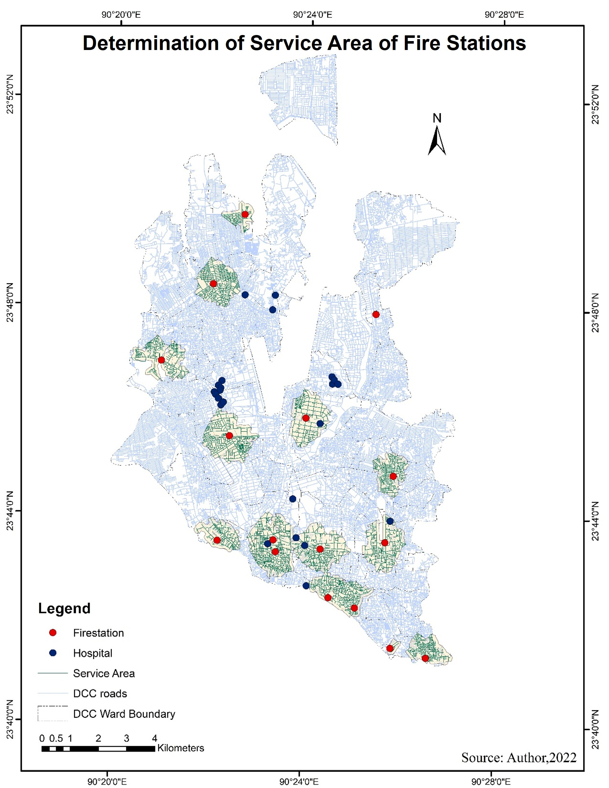
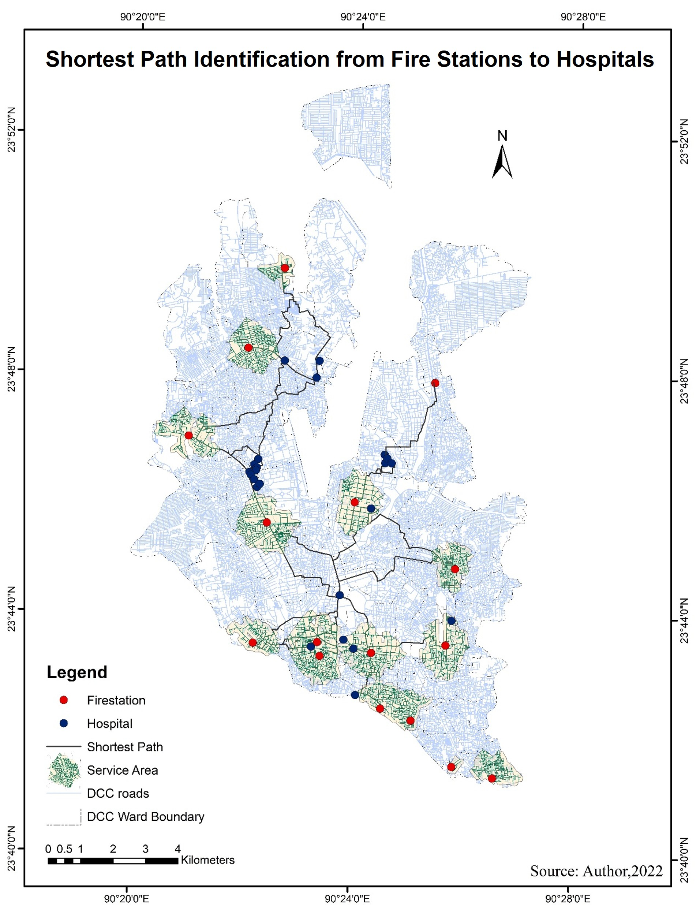
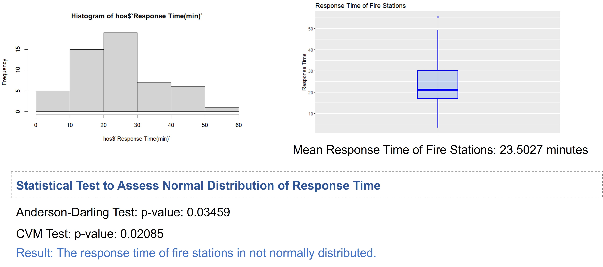
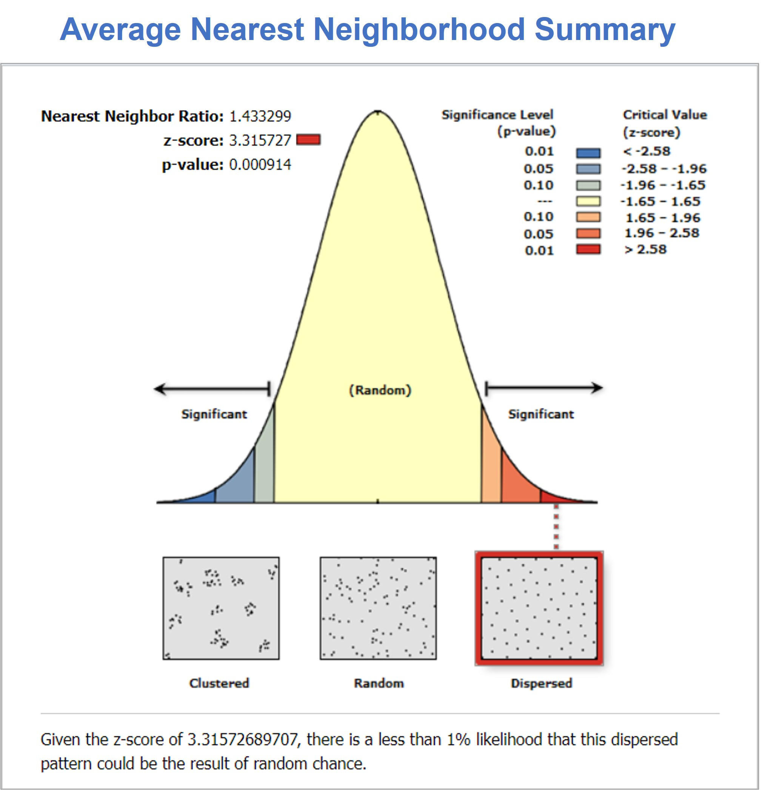
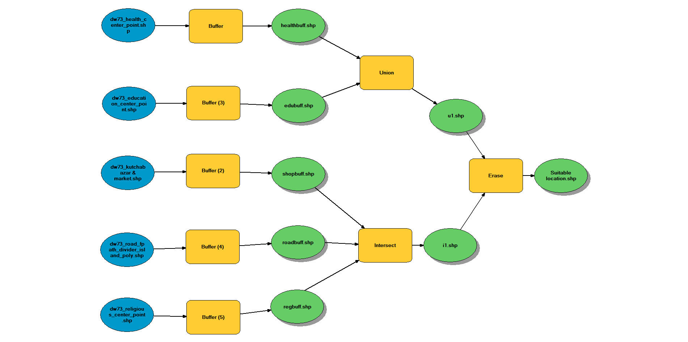
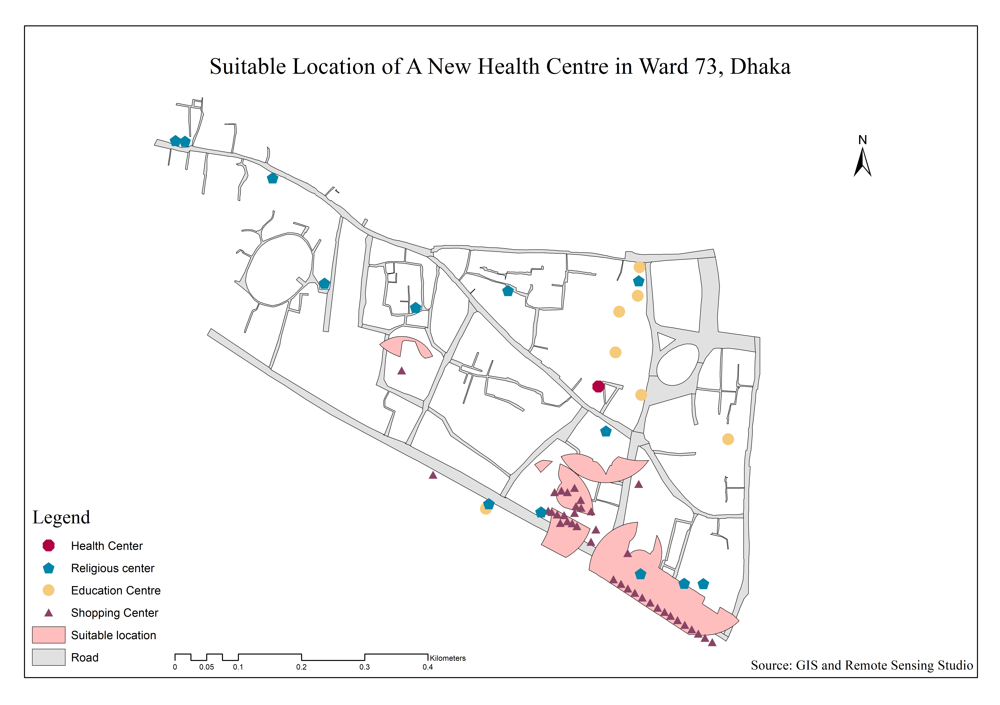

## <i>**📘 Project:** A GIS-based Network Analysis to Determine the Shortest Route and Service Area of Fire Stations to Hospitals for Emergency Response: A Case Study of Dhaka City Corporation </i>  

### **🎯 Objective** 
1. To identify the service area of existing fire stations.
2. To find out shortest route for providing fire service from fire stations to hospitals.  
3. To determine the response time for assessing the service of fire stations.
 

 <b>🏷️ Abstract</b> — <i>⬇️ Click the dropdown arrow (▸) to view. </i> 
 

Fires at hospitals are a typical occurrence that frequently causes considerable health and property damage. Fire stations should be well-equipped and prepared to give aid to hospitals in times of emergency. Response time is an important factor in determining the quality of a fire station's service. It is crucial for response times to be as short as possible. This response time is determined by the condition of the emergency response vehicle as well as any potential impediments or prohibitions on the road network. Hospitals in Bangladesh are also prone to fire accidents, and in times of emergency, the current road network, congestion, and unplanned land use create difficulties in providing an effective supply of fire service. The current study is an effort to model the shortestroute for a fire service to go through a road network using GIS technology and application on the tertiary hospitals of Dhaka City Corporation Area. This allows fire stations to take the shortest route possible, reducing emergency response time and helping to save lives and property. 

 
 

 

## 📊 Results

    
 

    
 

    
 

 

    
 

  
 
  

 
 

## <i>**📘 Project:** Land Suitability Analysis Applying Spatial Techniques of GIS </i>  

### **🏷️ Description**  
Different features of ward # 73 of Dhaka city were depicted. A suitable place to construct a new health center in that ward was identified considering following criteria:  

Criteria 1: The proposed place should be within 22 m distance from the nearby roads.  
Criteria 2: The proposed place should be within 82 m distance from the location of religious places.  
Criteria 3: The proposed place should be within 54 m distance from the location of shopping areas. 
Criteria 4: The proposed place should be beyond 104 m distance from the location of existing health centers.  
Criteria 5: The proposed place should be beyond 104 m distance from the location of educational institutes.  
 

### 📈 Suitability Analysis in ArcMap 10.8
- **Model for Land Suitability Analysis**
  

    
  

### 🏙️ Layout Map
  

    
  

