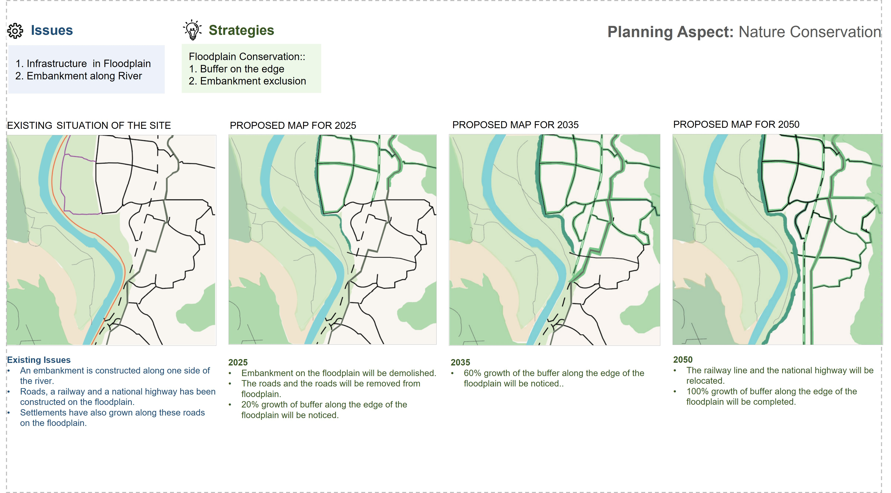

## <i>**📘 Project:** Landscape Planning of Jamuna River Basin. </i>  

**Project Type:** Design project  

**🎯 Objective** 
 1. To analyze the existing planning scheme of the site and its impact on ecology.
 2. To identify key issues of the site and propose strategies.
 3. To guide future planning strategies through landscape planning for conserving the environment and biodiversity.

  

---

    

# 📊 Result

    

    

    

    

    

    

    

 

