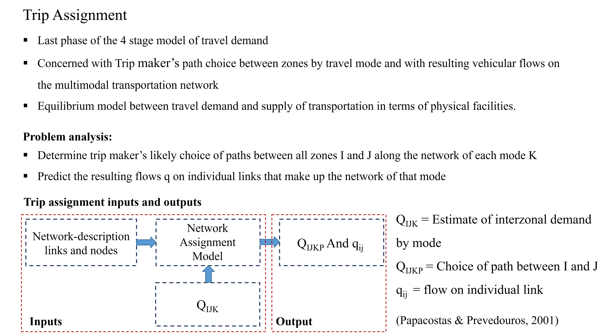
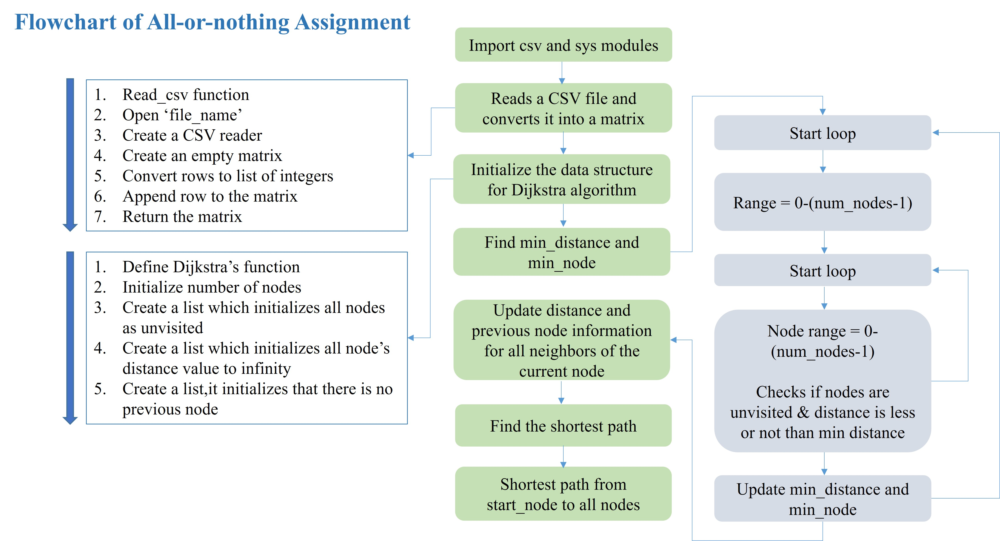
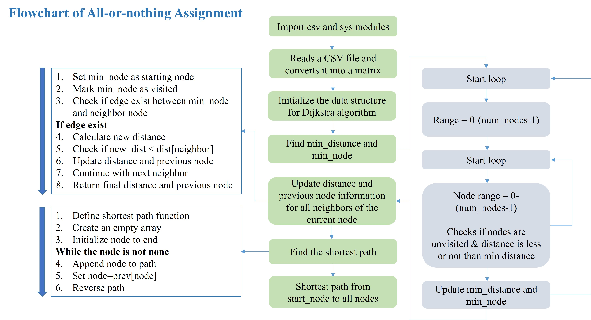
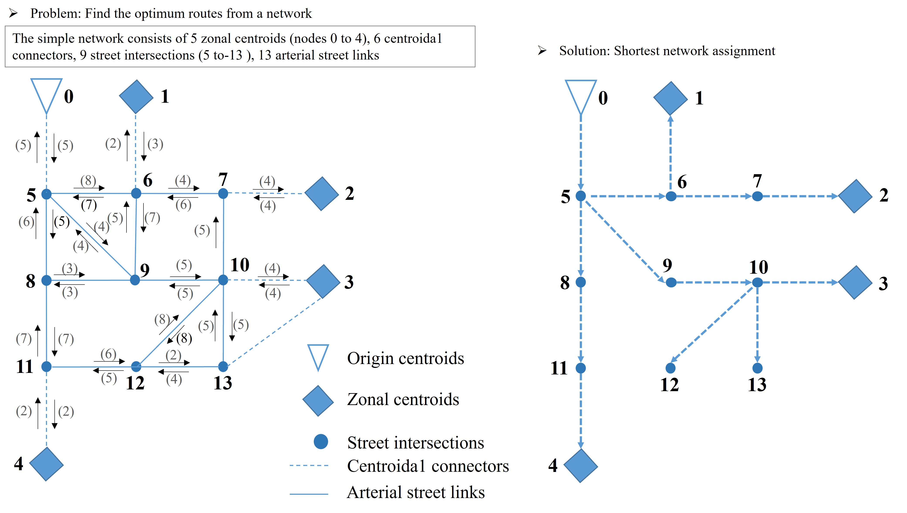

## <i>**Project:** 🚦 Trip Assignment — Identifying the Optimum Commuting Route</i>  

**🧾 Project Description:**  
The last phase of the 4-step travel demand model that allocates **OD trips** to **routes** (by mode) and computes **link flows** on a multimodal network—often posed as a demand–supply equilibrium problem.

  

---
## 🔧 Methodology
  

    
  

  

    
  

    

    
  

  
  ## 📊 Results
  
  

    
  

  

