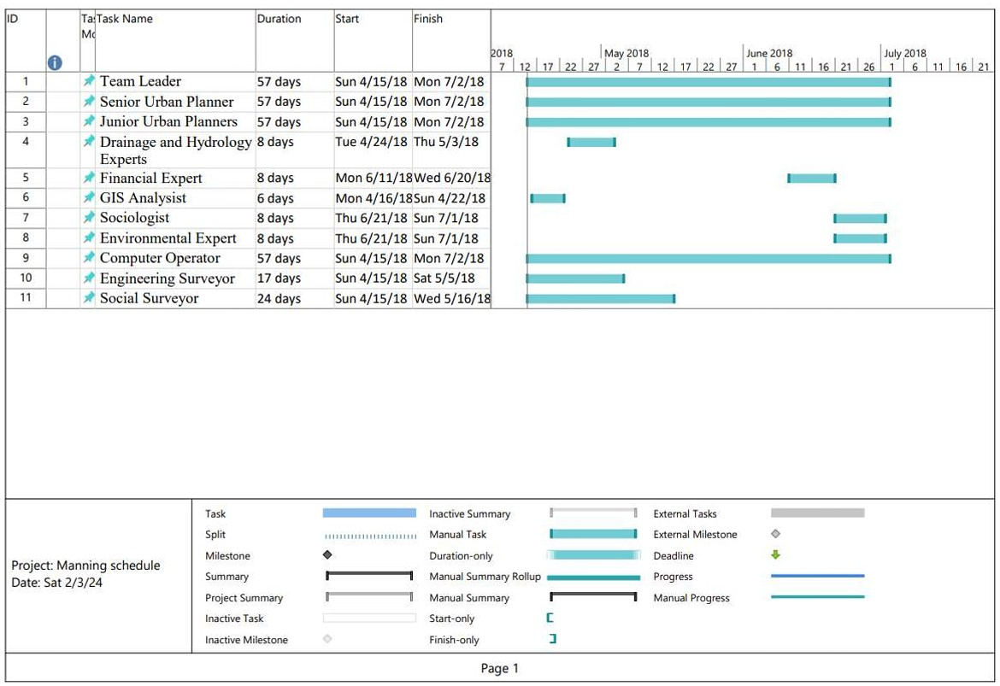
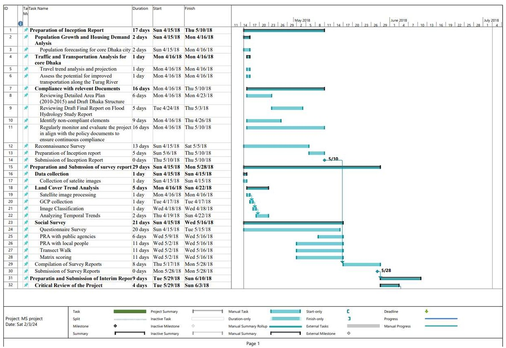
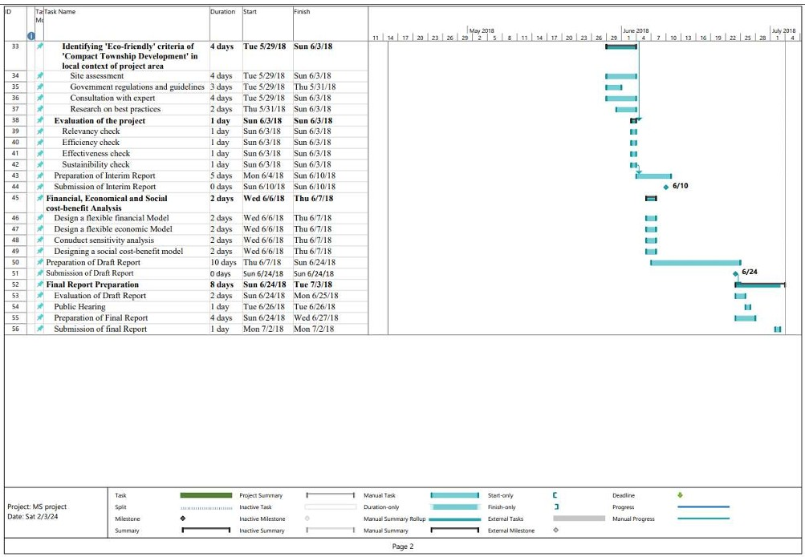
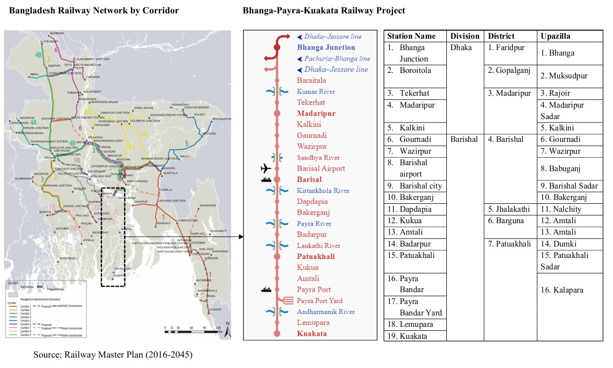
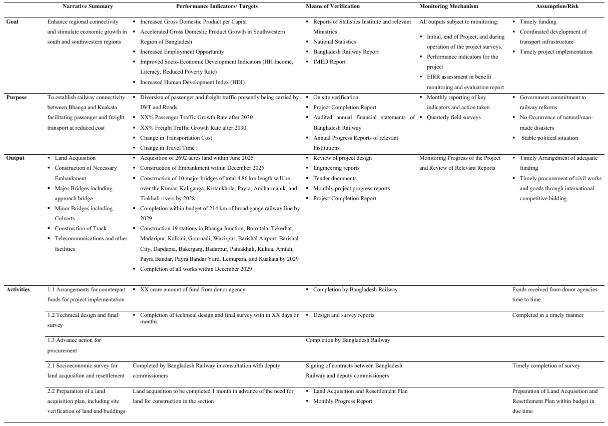

## <i>**Project 1:** Preparation of Concept Note</i> 
- **Title:** Sustainable Development Goal Localization to Strengthen Cities through Innovative Technology Integration for Urban Sustainability  
 

## <i>**Project 2:** Preparation of Terms of Reference</i> 
- **Title:** Terms of Reference for Rural Infrastructure Improvement Project in Haor Region of Bangladesh   
 

## <i>**Project 3:** Preparation of Technical and Financial Proposal</i> 
- **Title:**  Feasibility Study (Proposed Conservation of Flood Zone of Turag River and Compact Township Development Project) 
 

- **Manning Schedule**
  

    
  

  
- **Working Schedule**
  

    
    
  

## <i>**Project 4:** Preparation of Development Project Proposal</i> 
- **Title:**  Construction of New Railway Corridor from Bhanga to Kuakata Connecting Payra Port.  
 
- **Project Location**
  

    
  

- **Project Logical Framework**
  

    
  

