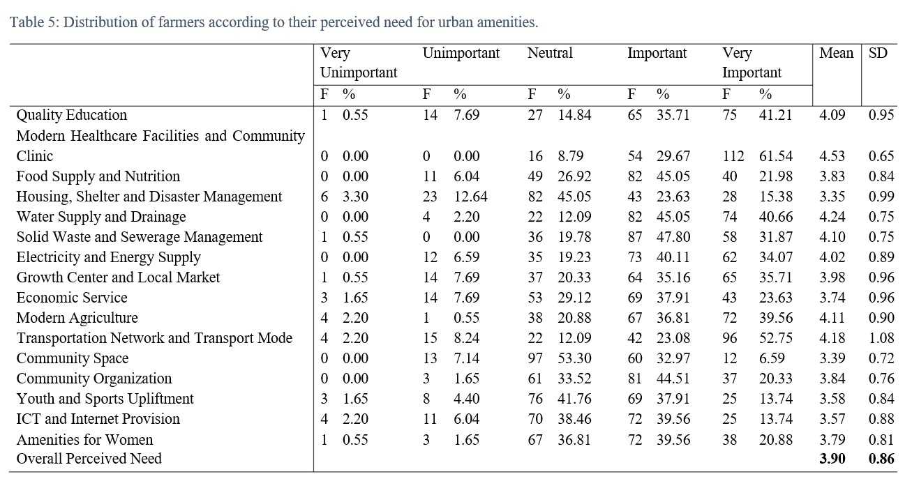
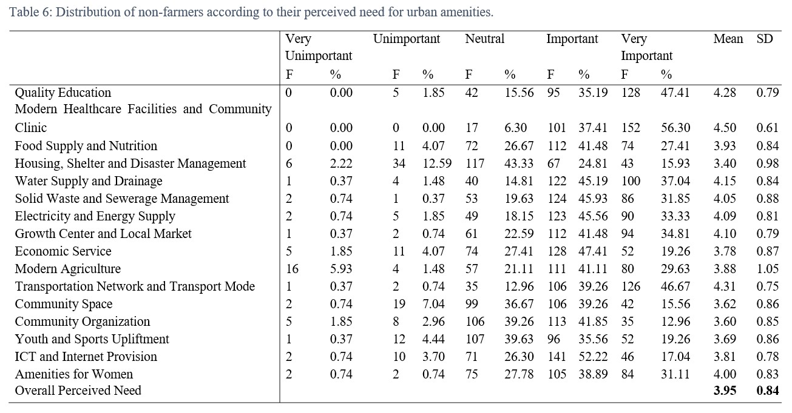
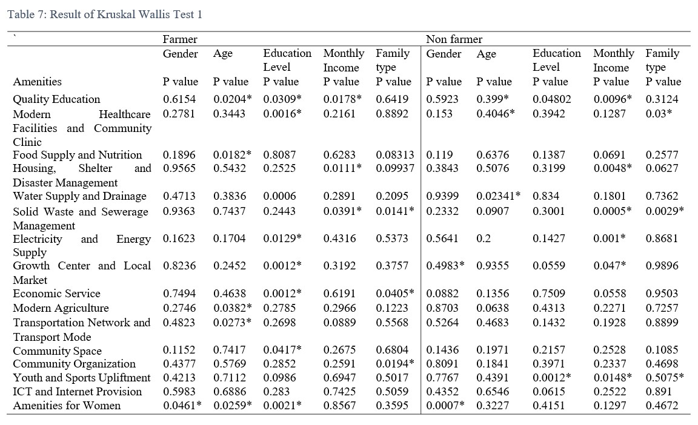
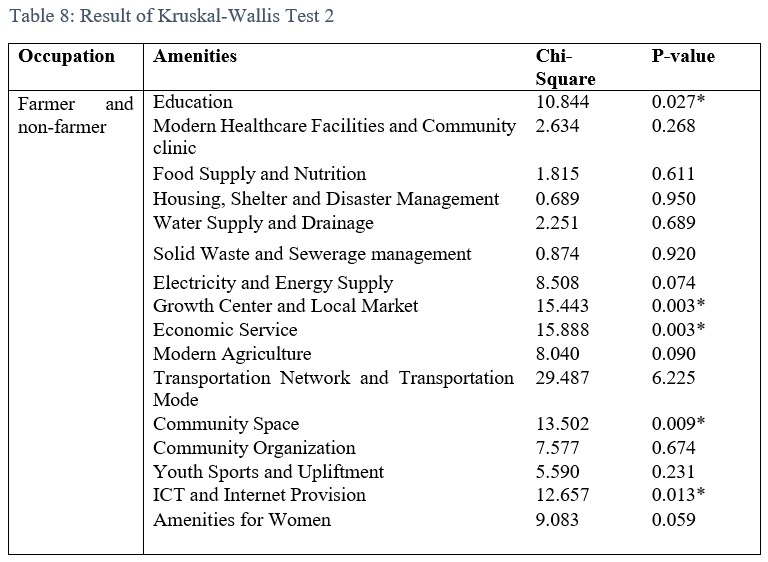
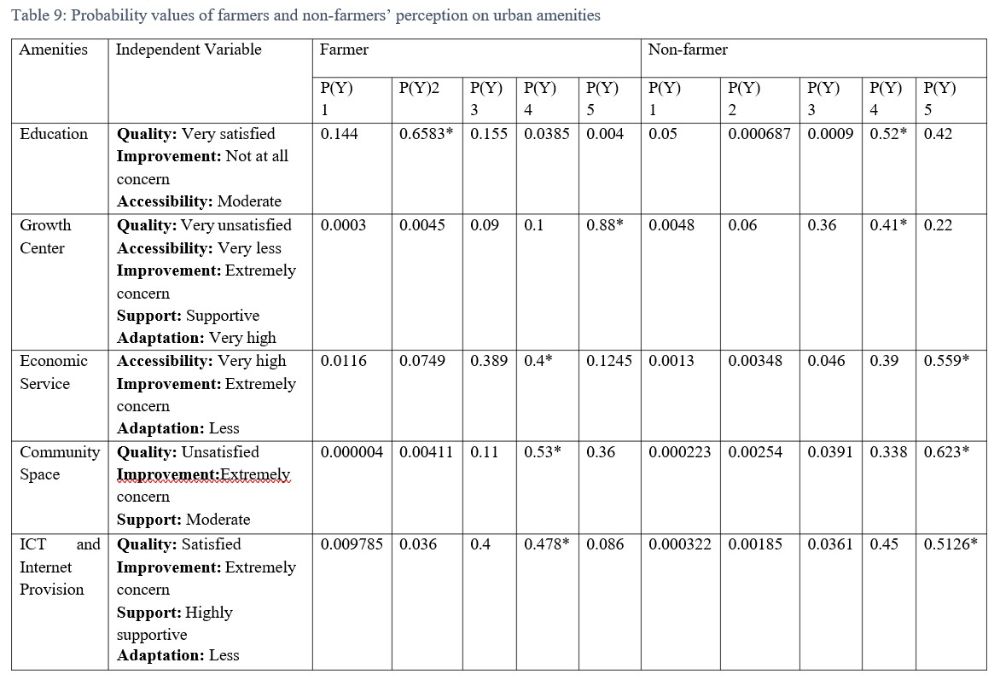

## <i>**📘Project Title:** Exploring Variation in Farming and Non-Farming Communities’ Perception on Urban Amenities in Rural Areas of Bangladesh</i>  

**🎯 Abstract**  

Before initiating any rural development program to fulfill rural people’s need and expectation, it is essential to comprehend farming and non-farming communities’ perception on urban amenities in rural areas. This study aimed to determine the socio- economic factors that influence farmers and non-farmers’ perceived need for urban amenities in rural Bangladesh. In addition, this study explores how farming and non-farming communities’ perception vary for different urban amenities in rural Bangladesh. Data were collected through a questionnaire from random sample of 452 respondents in rural areas of Dhaka, Mymensingh, Rajshahi and Chittagong divisions of Bangladesh. Descriptive statistics, inferential statistics and an ordered logistic- regression model were used to analyze the data. Farmers and non- farmers’ perception on urban amenities in rural areas have been studied based on quality and accessibility of urban amenities, their need for improvement, the extent to which urban amenities support people’s livelihood and their adaptation level. The results shows that socio-economic characteristics, which include gender, age, education level, monthly income, family type have significant influence on farmers and non-farmers’ perceived need for urban amenities in rural areas. Both farmers and non-farmers perceived that provision of urban amenities in rural areas is important. However, these two communities’ perception significantly varies for education, growth center and local market, economic service, community space, information and communication technology and internet provision. The results provide practical guidelines for improving urban amenities in rural Bangladesh to support farming and non-farming communities.

 

  

## 📈 Results

    
  

    
  

    
  

    
  

    
  

   
  

