## <i>**📘 Project:** Potentials of development in proposed MRT station areas - A study on Agargaon MRT station. </i>  

**Project Type:** Design project  

**🎯 Objective** 
1. To explore the land use pattern and socioeconomic context in surround areas of Agargaon MRT station. 
2. To propose a land use plan compatible with the MRT station in the study area.  

  
 

# 📊 Result

    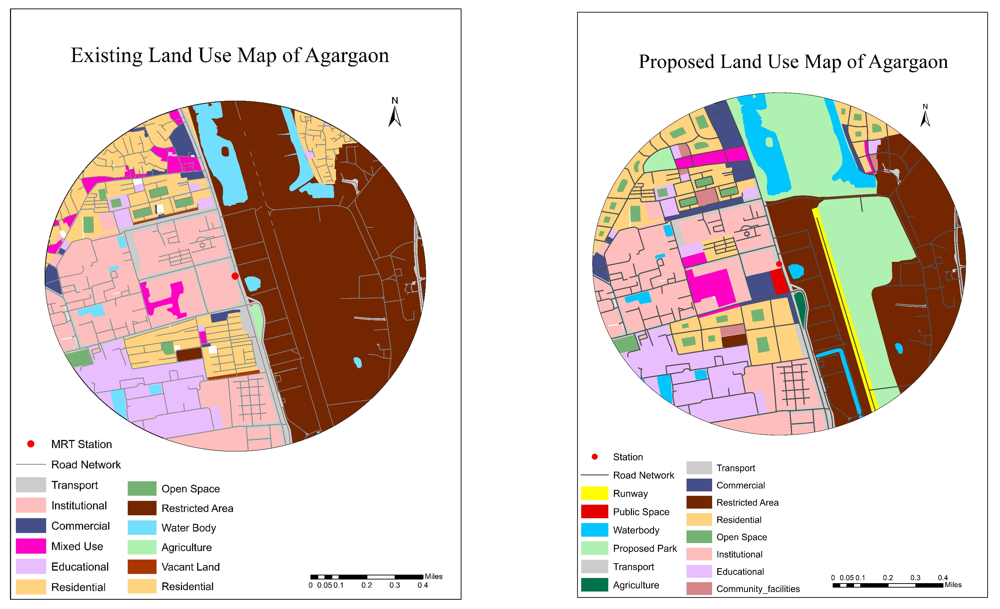

 

    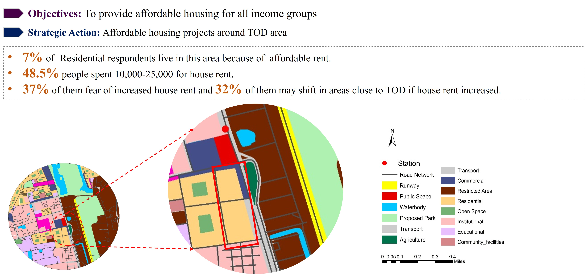

 

    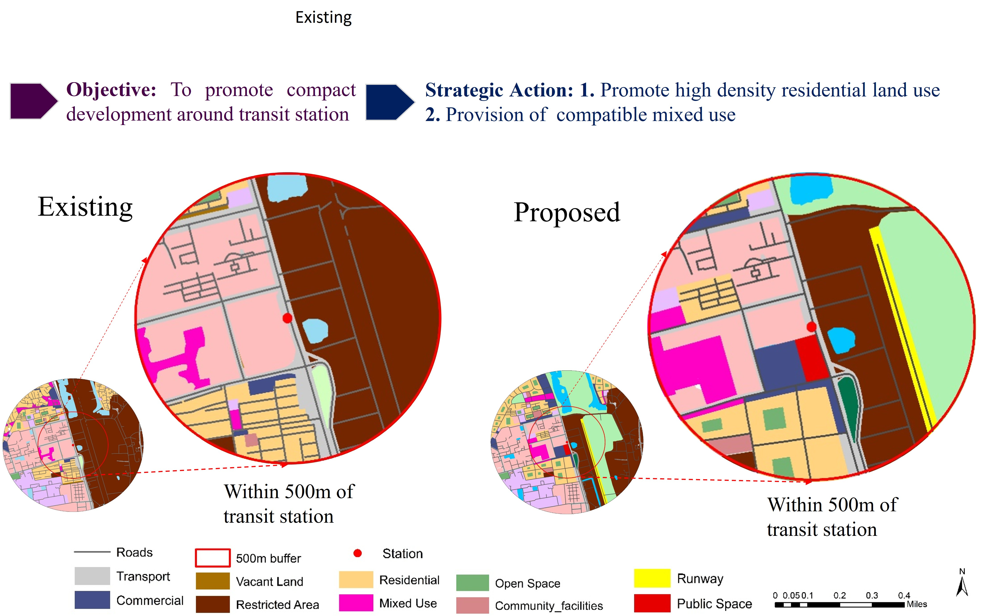

 

    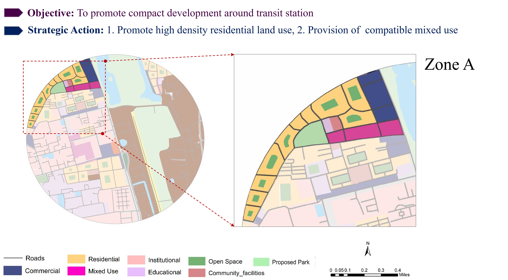

 

    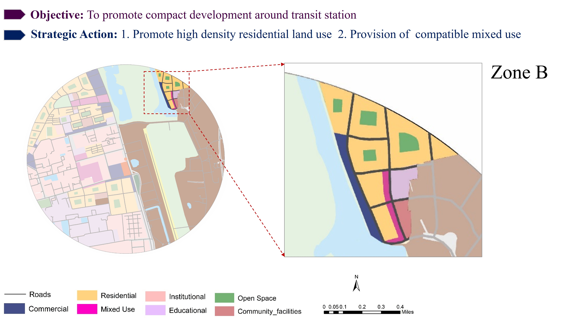

 

    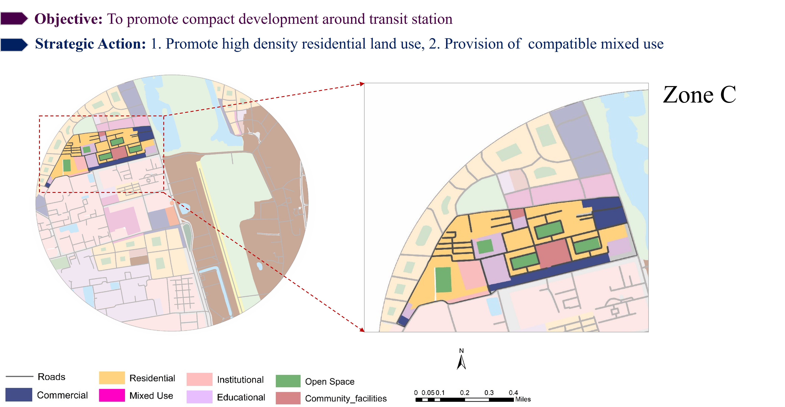

 

    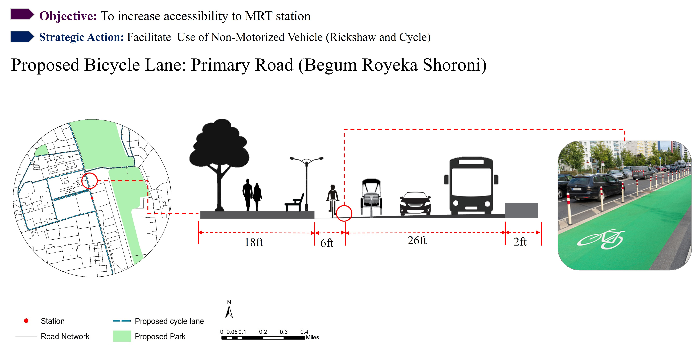

 

    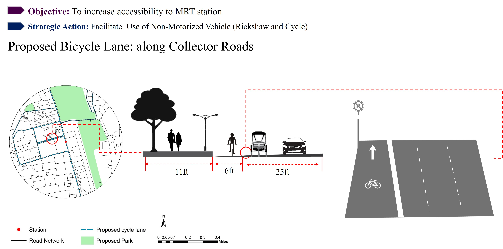

 

    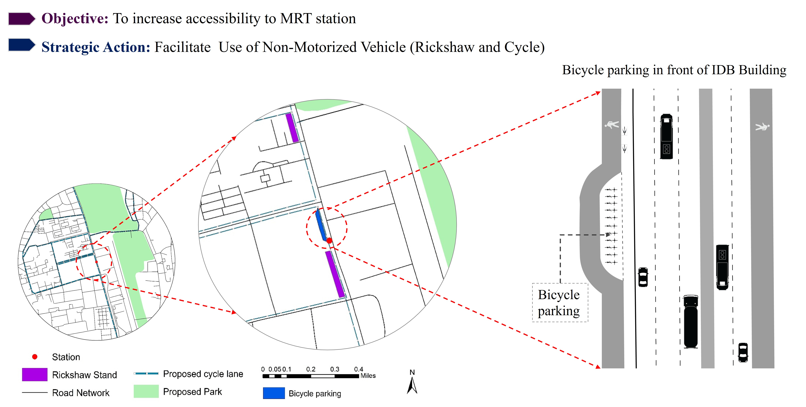

 

    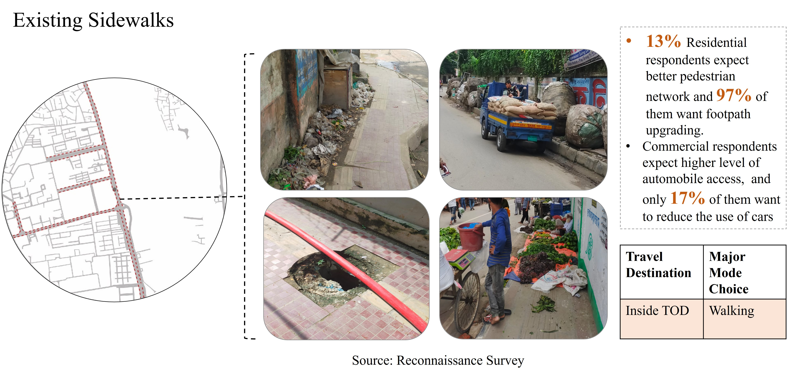

    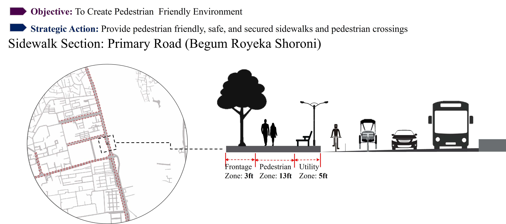

    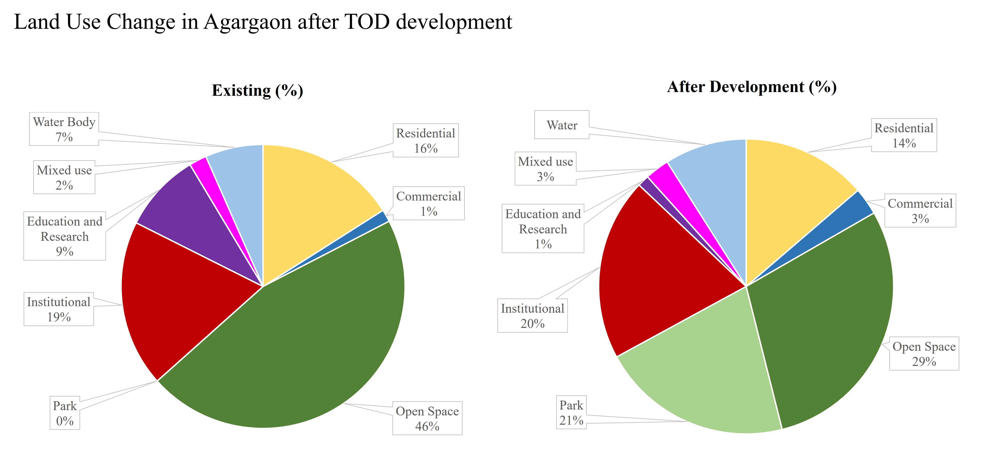

 

## <i>**📘 Project:** Potentials of slum improvement in proposed low-income settlements in DAP</i>  

**Project Type:** Policy level project  

**🎯 Objective** 
1. To review DAP strategy in consideration of structure plan proposal.
2. To identify the potentials of slum upgradation in the proposed location in DAP.

  
 

    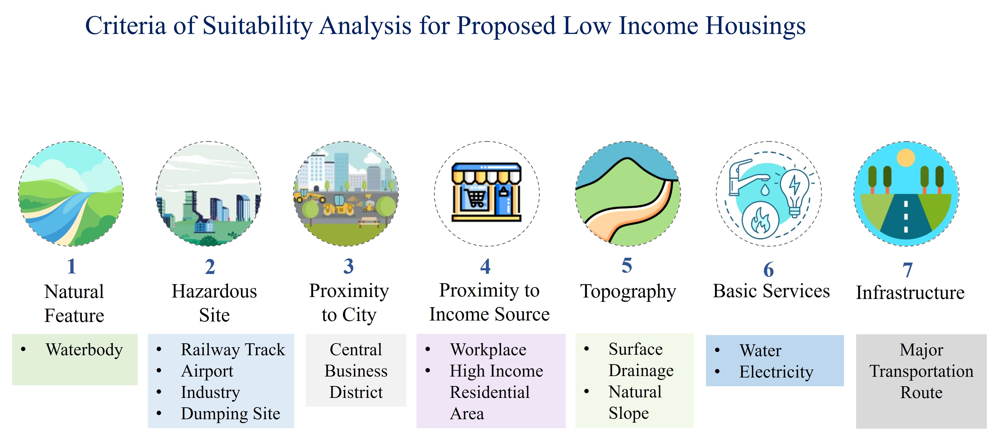

 

## 📊 Result

    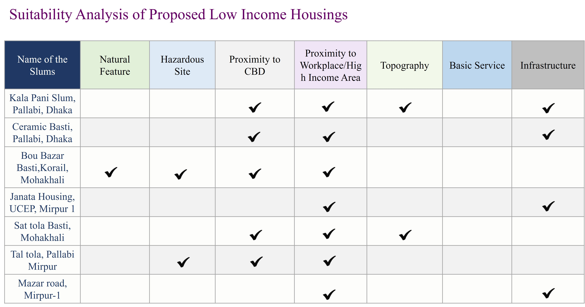

    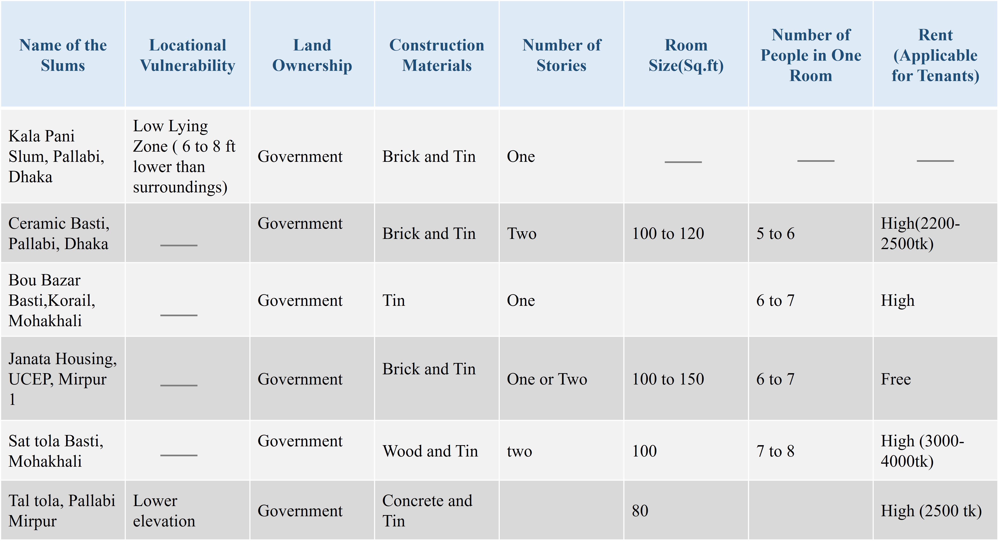

    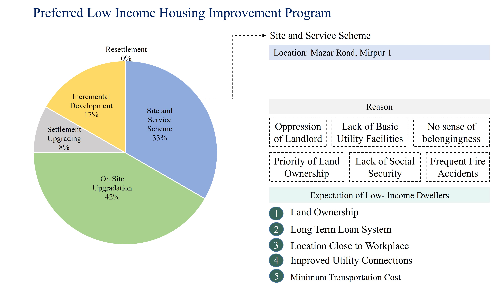

    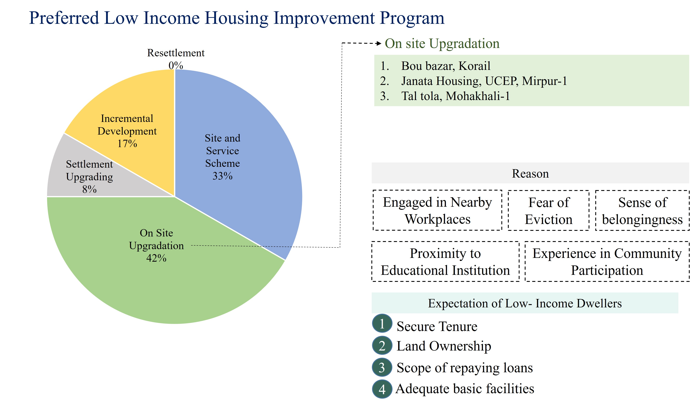

 

