<!-- =========================
     Survey Outputs (PNG Gallery)
     ========================= -->
<section id="survey-outputs">
  <h2>🗂️ Survey Outputs & Visualizations</h2>
  
Click any card to view full size. Use the filters to switch categories.

  <!-- Filters -->
  

    <button class="filter-btn active" data-filter="all">All</button>
    <button class="filter-btn" data-filter="service">Service Areas</button>
    <button class="filter-btn" data-filter="heatmap">Heatmaps</button>
    <button class="filter-btn" data-filter="od">OD Matrices</button>
    <button class="filter-btn" data-filter="accident">Accident Maps</button>
  

  <!-- Grid -->
  

    <!-- Service Areas -->
    <figure class="g-item" data-cat="service">
      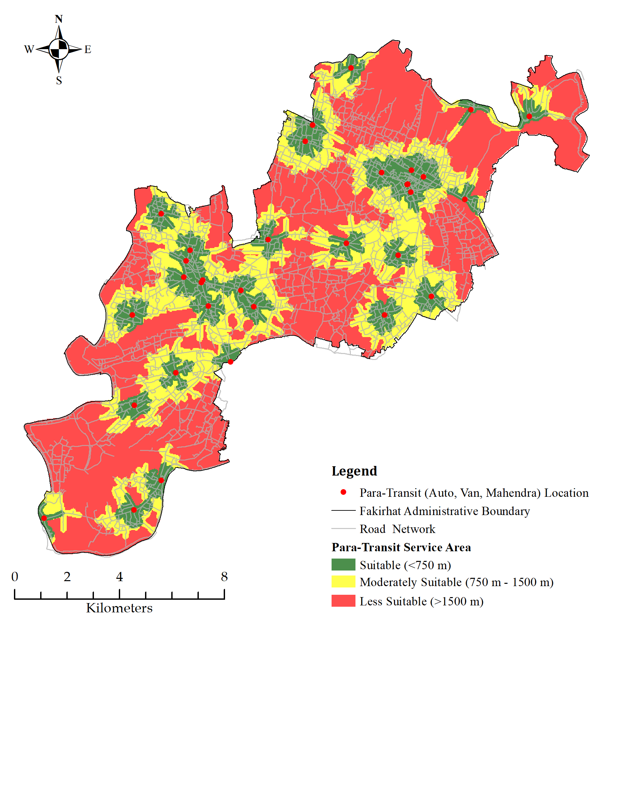
      <figcaption>Paratransit Service Area</figcaption>
    </figure>
    <figure class="g-item" data-cat="service">
      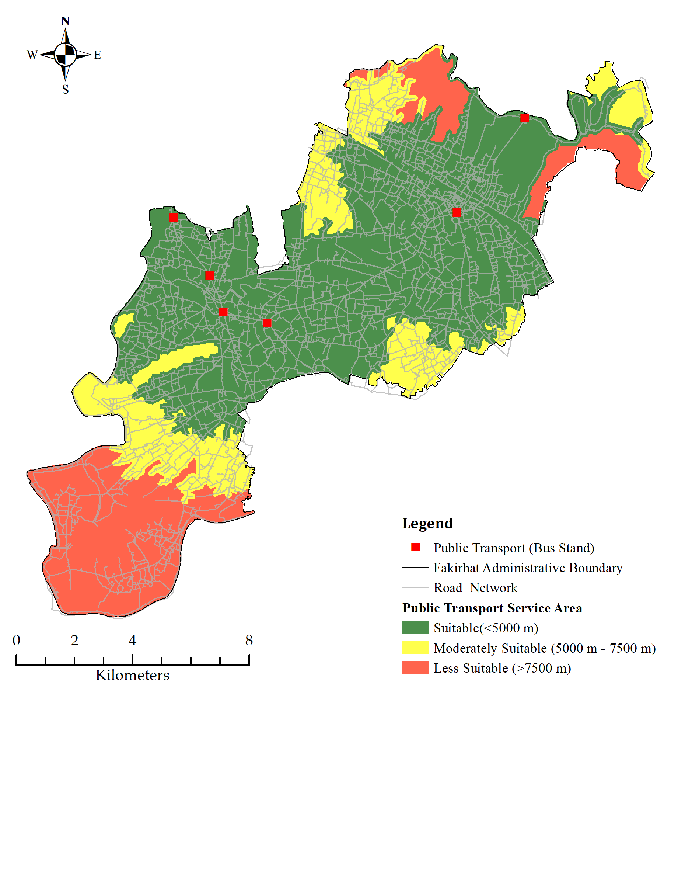
      <figcaption>Public Transport Service Area</figcaption>
    </figure>
    <figure class="g-item" data-cat="service">
      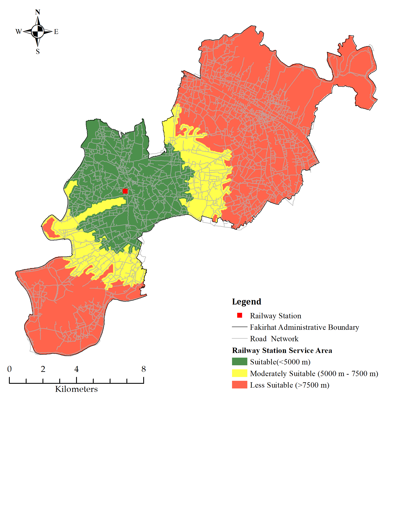
      <figcaption>Railway Service Area</figcaption>
    </figure>

    <!-- Heatmaps (e.g., different time bands / days) -->
    <figure class="g-item" data-cat="heatmap">
      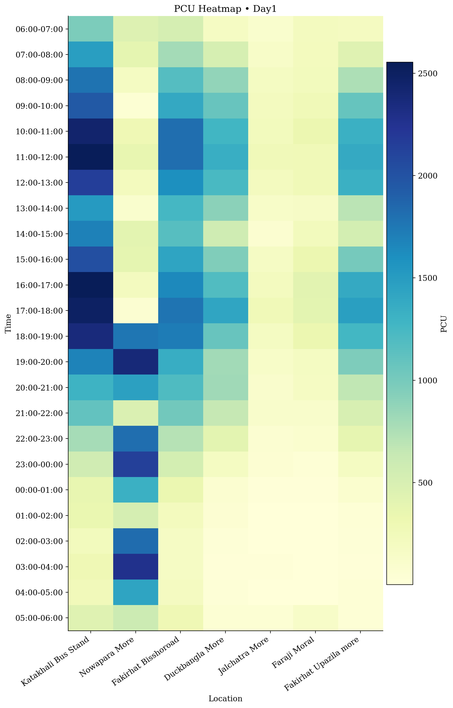
      <figcaption>Heatmap — AM Peak (Day 1)</figcaption>
    </figure>
    <figure class="g-item" data-cat="heatmap">
      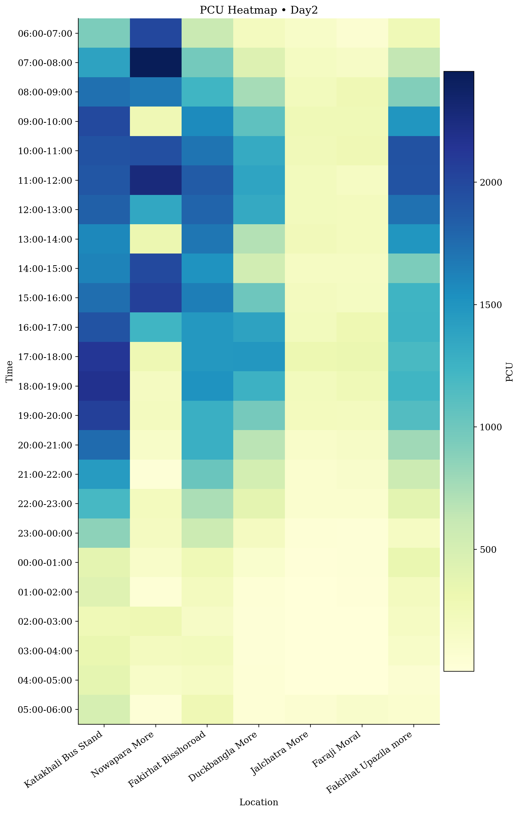
      <figcaption>Heatmap — Midday (Day 2)</figcaption>
    </figure>
    <figure class="g-item" data-cat="heatmap">
      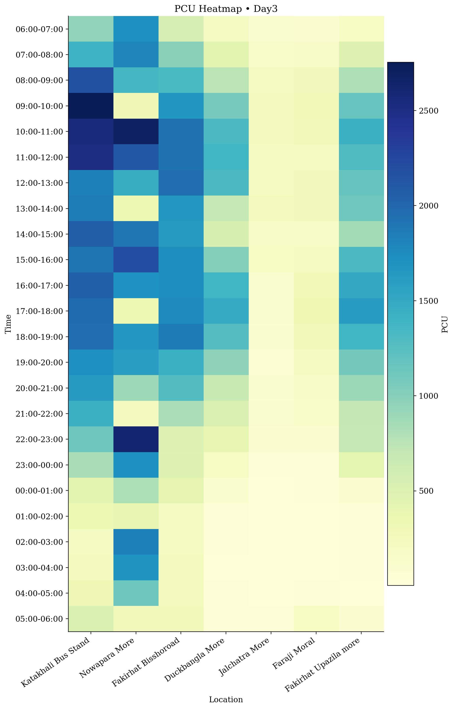
      <figcaption>Heatmap — PM Peak (Day 3)</figcaption>
    </figure>

    <!-- OD Matrices -->
    <figure class="g-item" data-cat="od">
      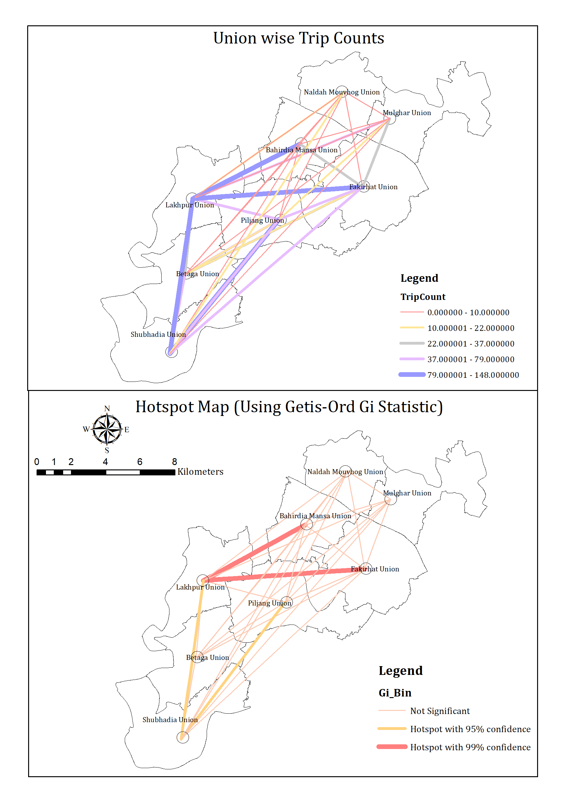
      <figcaption>OD Matrix — Overall</figcaption>
    </figure>

    <!-- Accident Maps -->
    <figure class="g-item" data-cat="accident">
      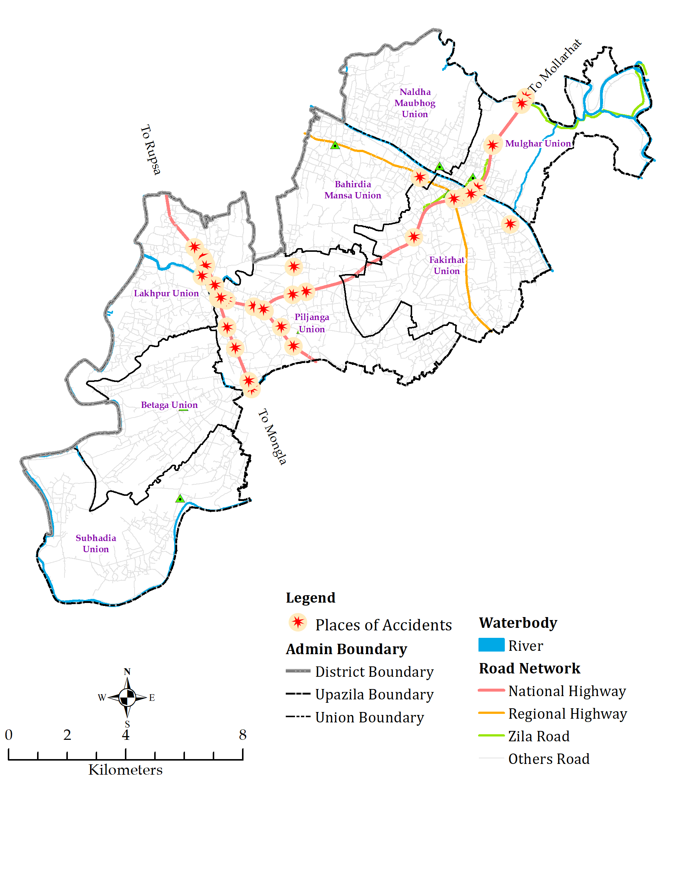
      <figcaption>Accident Clusters (Police Data)</figcaption>
    </figure>
    <figure class="g-item" data-cat="accident">
      
      <figcaption>Black Spots & Countermeasures</figcaption>
    </figure>
  

  <!-- Lightbox dialog -->
  <dialog id="lightbox" aria-labelledby="lb-title">
    

      
      

      

        <a id="lb-download" class="btn" href="#" download>Download PNG</a>
        <button class="btn-outline" value="close">Close</button>
      

      <button class="nav prev" aria-label="Previous image">‹</button>
      <button class="nav next" aria-label="Next image">›</button>
    

  </dialog>
</section>

**💼 Designation** - Assistant Urban Planner  

**🏢 Organization** - <a href="https://www.scplbd.com/" target="_blank">Sheltech Consultants (Pvt.) Ltd.</a> 

🗓️ October 2024 – Present

---

**📋Key Reponsibilities**  

▪ Currently working on "Upazila Town (Non-Municipal) Master Plan Preparation and Basic Infrastructure Development Project" funded by GoB (Government of Bangladesh). 
▪ Support **urban and regional planning projects** through **field surveys, data analysis, and technical reporting**.  
▪ Assist in **preparing maps and planning documents** using GIS and design tools.  
▪ Collaborate with senior planners, engineers, and local authorities to ensure compliance and inclusivity in planning.  
▪ Contribute to organizing **stakeholder consultations, workshops, and community engagement sessions.**  
▪ Help **drafting master plans, infrastructure proposals, and policy recommendations.**  
▪ Strengthen skills in spatial analysis, research, and multidisciplinary collaboration.  

---

### 👥 Workshop
- **🚦 Promoting Road Safety through Data-Driven Planning & Community Engagement**  

  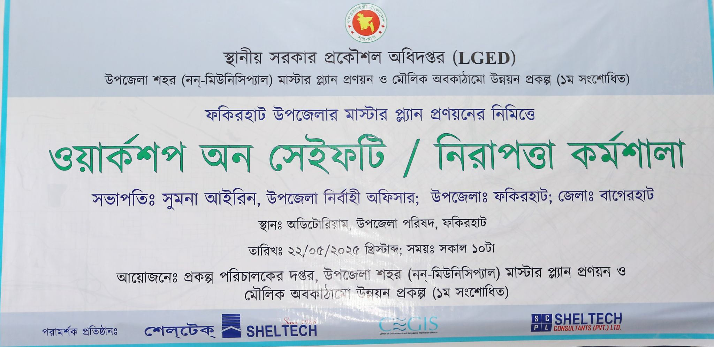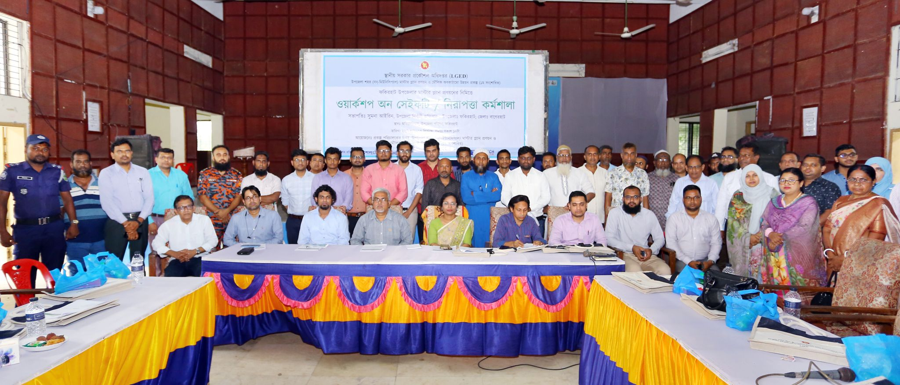
  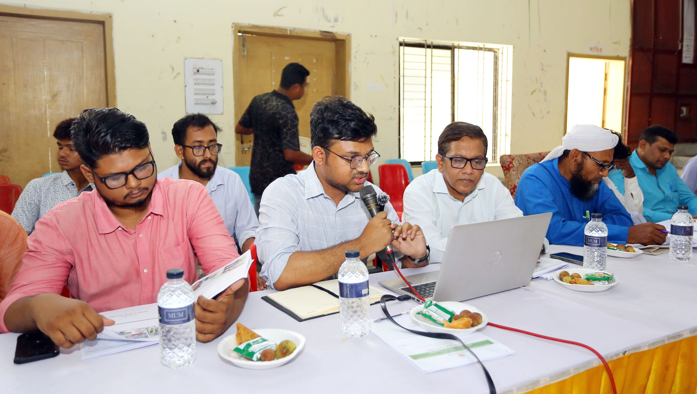

- **Location:** Fakirhat Upazila, Bagerhat District, Bangladesh  
- **Project:** Upazila Town Master Plan & Basic Infrastructure Development  

**Purpose**
- Share findings from recent transport surveys  
- Validate the **core road network** with stakeholders  
- Identify **accident-prone locations (black spots)**  
- Co-design **road safety improvements**

**My Roles:** Organizer & Presenter

**Responsibilities**
- Led workshop design and facilitation; co-presented with **Prof. Dr. Md. Shahid Mamun (Transport Expert)**  
- Supervised field teams during November data collection (10 survey types):**TCS, PCS, OD, PTPS, PIS, Parking, Train Station, Transport Inventory, Speed–Delay, Black-spot mapping**  
- Integrated survey results with community inputs to inform the master plan

**Participants**
- **UNO (Upazila Nirbahi Officer)**, Deputy Team Leader, govt officials, transport operators, and project consultants

