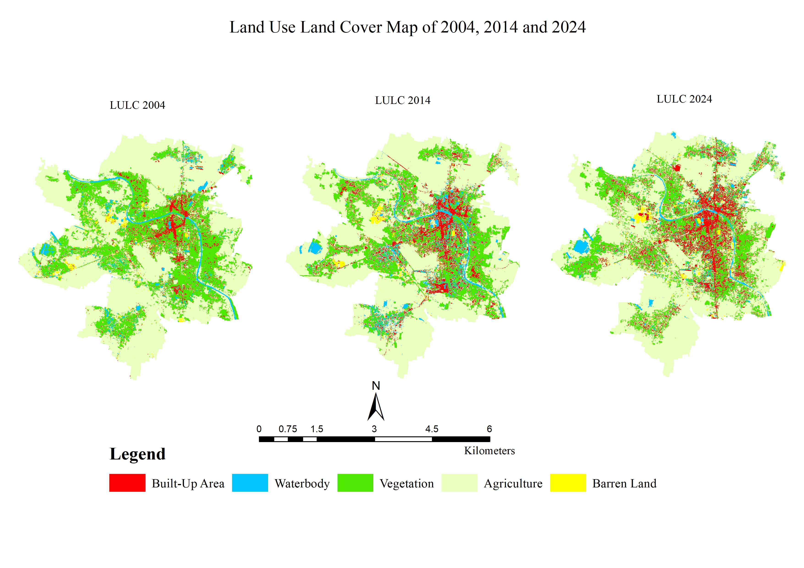
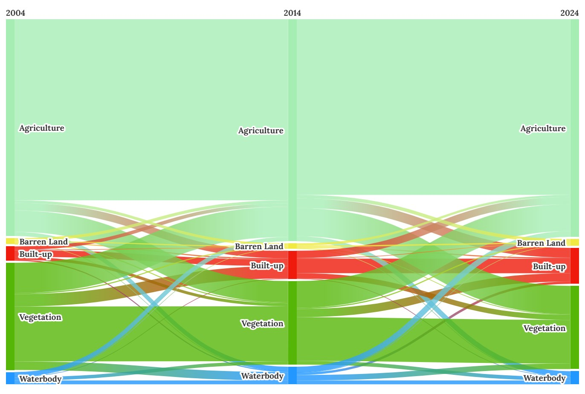
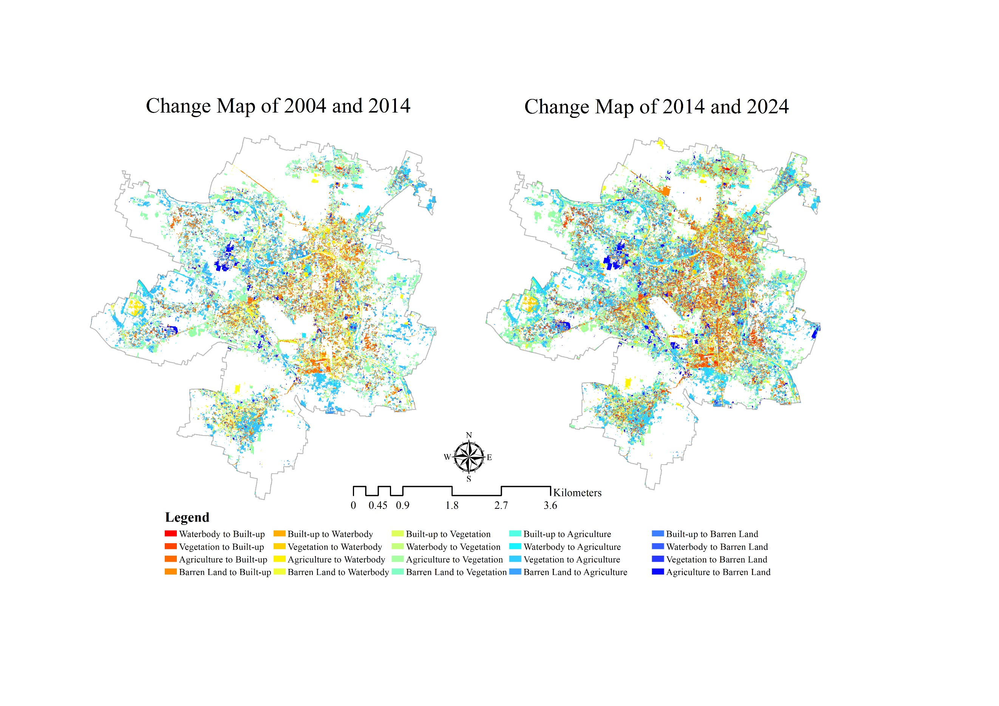
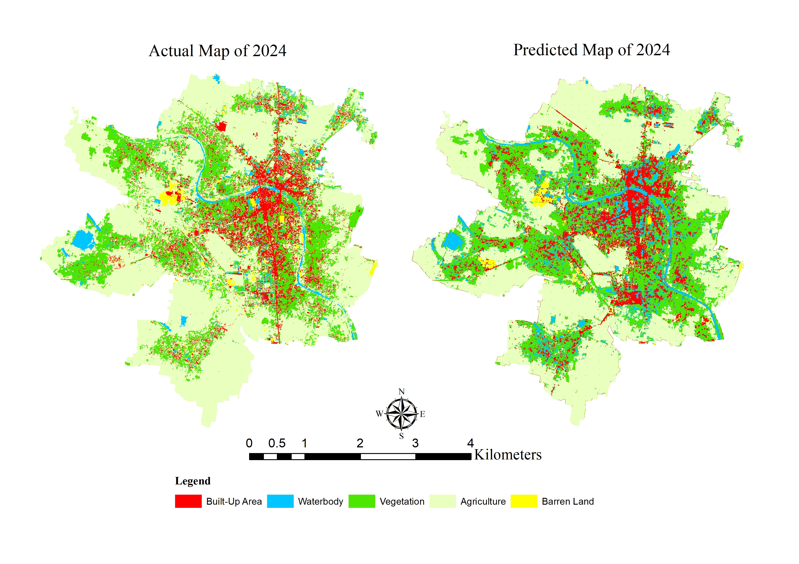
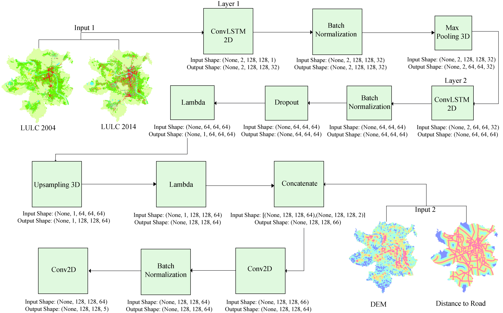
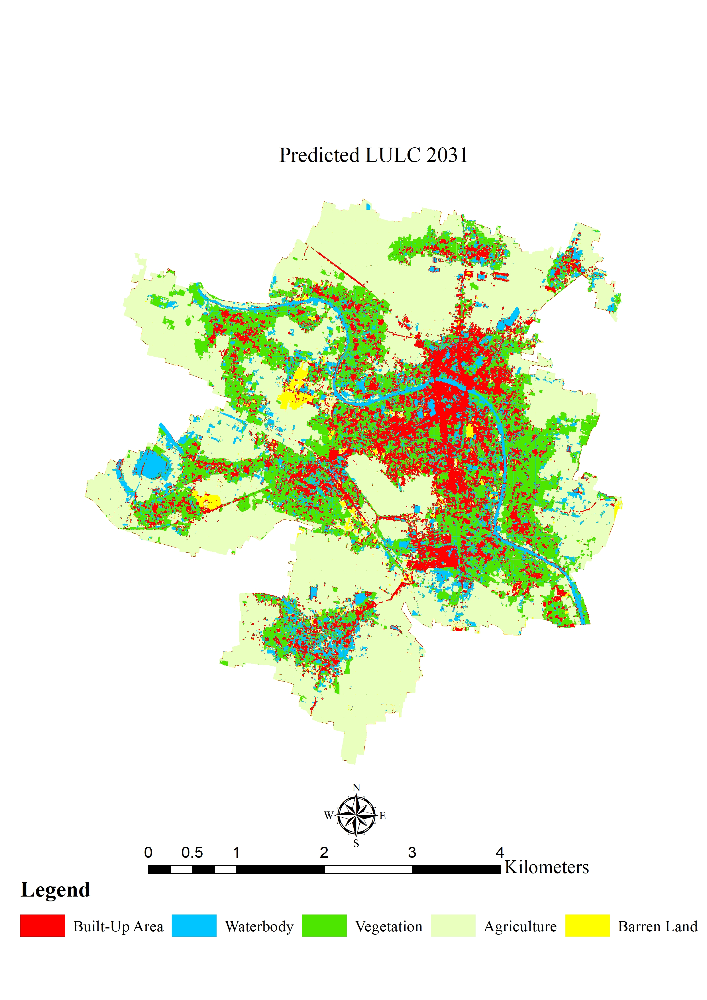
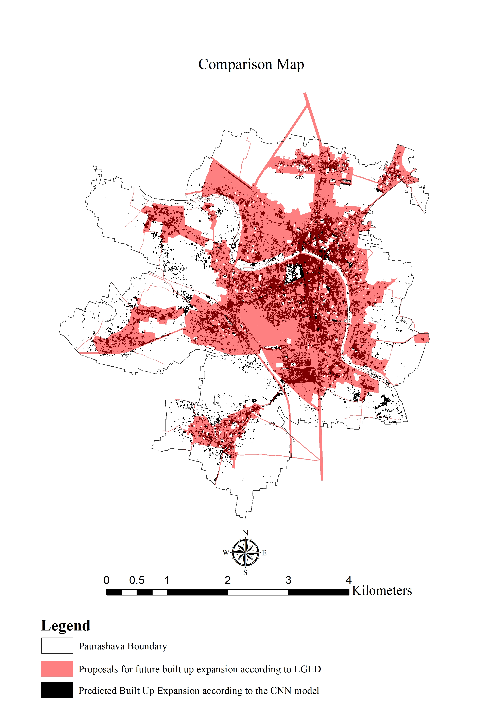
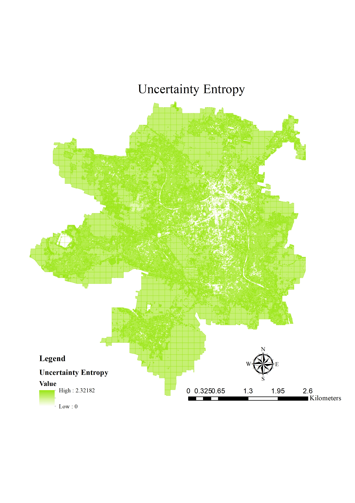
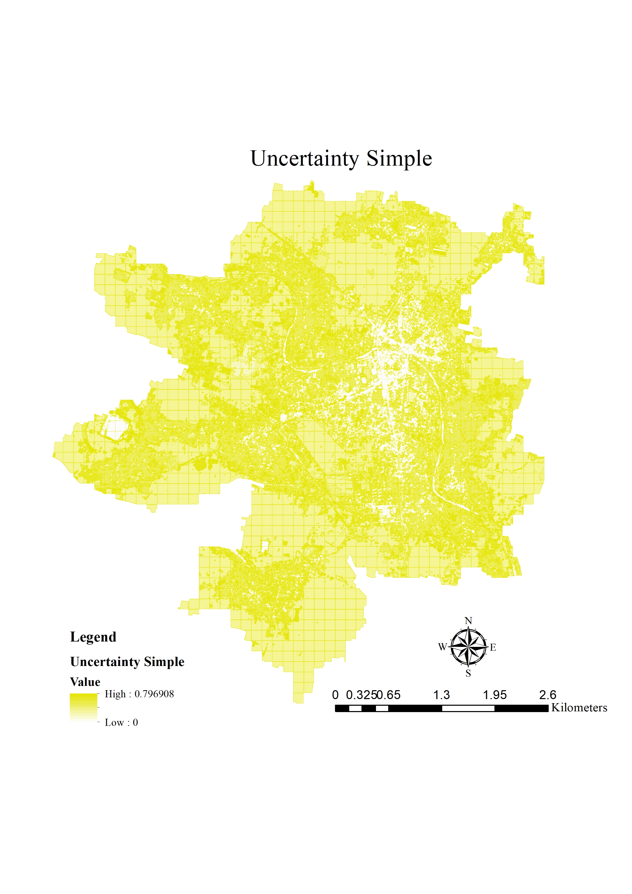

# Framework for Predicting Urban Growth Pattern in Data Scarce Region

## 🔑 Objective
1. To predict land use/land cover (LULC) changes of a municipality in Bangladesh using a ConvLSTM model with static drivers (DEM, distance to road).
2. Comparison of the Predicted Growth with the proposals of Municipalitie's master plan.

...

# Growth Pattern Analysis by Maximum Likelihood Supervised Classification

## 🗺️ Land Cover Maps

## 🔄 Land Use Transitions
**Sankey Diagram (2004–2014–2024):**  

- Vegetation and agriculture were the major sources of built-up growth.  
- Bidirectional transitions observed between vegetation and agriculture.  
- Built-up areas increased from **0.88 km² (4.01%) in 2004 → 2.22 km² (10.07%) in 2024**.  

---

## 📉 Change & Comparison Maps
**Change Detection:**  

**Comparison of Actual vs Predicted (2024):**  

- Actual built-up: **2.22 km²**  
- Predicted built-up: **2.48 km²** (well aligned, slight overestimation)  

---

## 🏗️ Model Architecture

**ConvLSTM Setup**
- Inputs: LULC (2004, 2014), DEM, Distance-to-road (patches 128×128)  
- Layers: 2 × ConvLSTM2D (filters: 32, 64), batch norm, dropout, up/down-sampling  
- Loss: Categorical Cross-Entropy, Optimizer: Adam (lr=0.0001)  
- Metrics: Overall Accuracy (65%), F1 Score (66%), QADI (0.09–0.13)  

---
## 🔮 Prediction Maps
**Predicted LULC (2031):**  

**Comparison with Master Plan (2031):**  

- Model forecasts built-up growth to **3.53 km² by 2031**.  
- Some “urban deferred” zones in the master plan showed discrepancies with actual growth direction.  

---

## ⚠️ Uncertainty Analysis
| Entropy Map | Uncertainty Map |
|-------------|-----------------|
|  |  |

- Low entropy & high confidence in **central built-up zones**.  
- Higher uncertainty in transitional zones (vegetation/agriculture).  

---

## 📌 Key Findings
- Built-up growth followed a **linear, road-oriented pattern** (N7 highway, Chitra river).  
- **Vegetation decreased** (30.04% → 23.31%), while agriculture remained mostly stable.  
- **Waterbodies** declined from 1.74 km² (2014) → 0.81 km² (2024), reflecting weak enforcement of conservation policies.  
- ConvLSTM predictions aligned closely with actual 2024 LULC, outperforming CA–ANN.  
- **Uncertainty analysis** confirmed reliable classification in central urban zones.  
- Master plan (2031) projections did not fully capture growth in “deferred” areas.  

---

## 📖 Takeaways
- ConvLSTM provides a robust framework for **predicting small-town urban growth** using freely available imagery.  
- Results highlight the **importance of integrating ML/DL with planning** to reduce reliance on outdated population-based projections.  
- Findings can guide **policy-makers** in revising master plans and adopting **evidence-based zoning** for sustainable development.  

