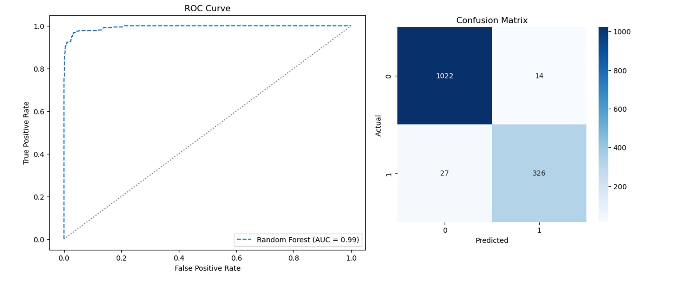
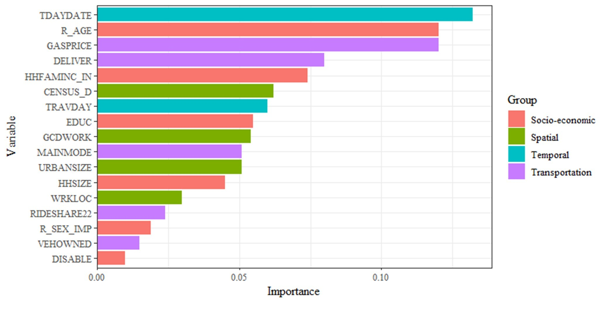
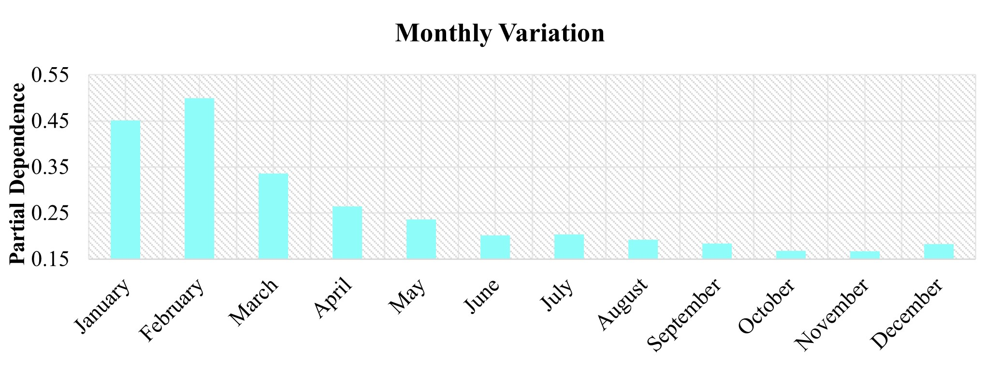
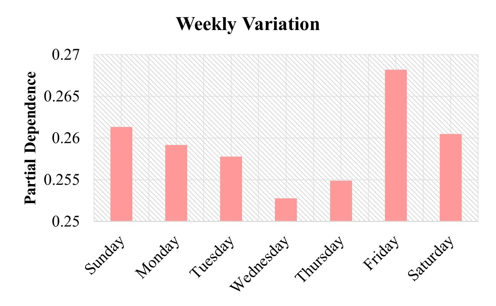
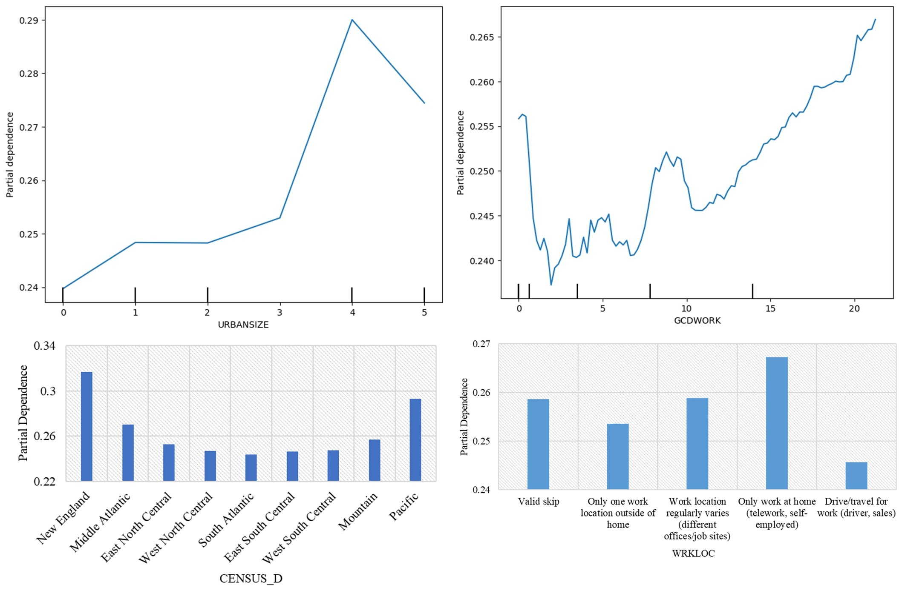
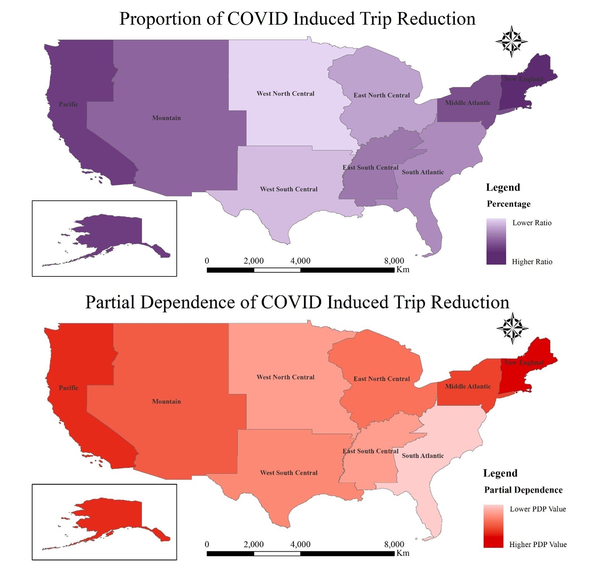
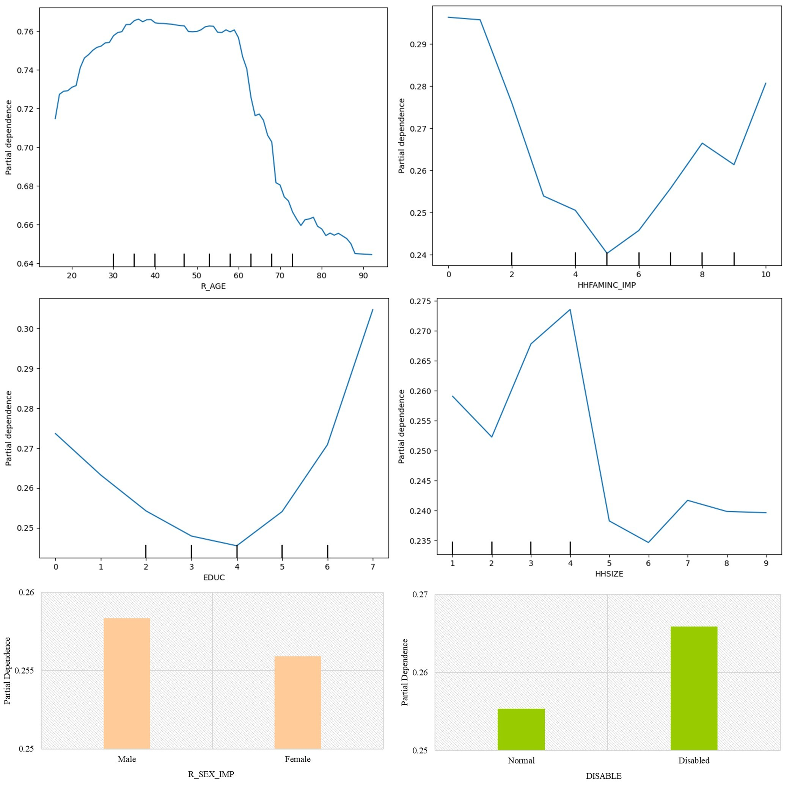
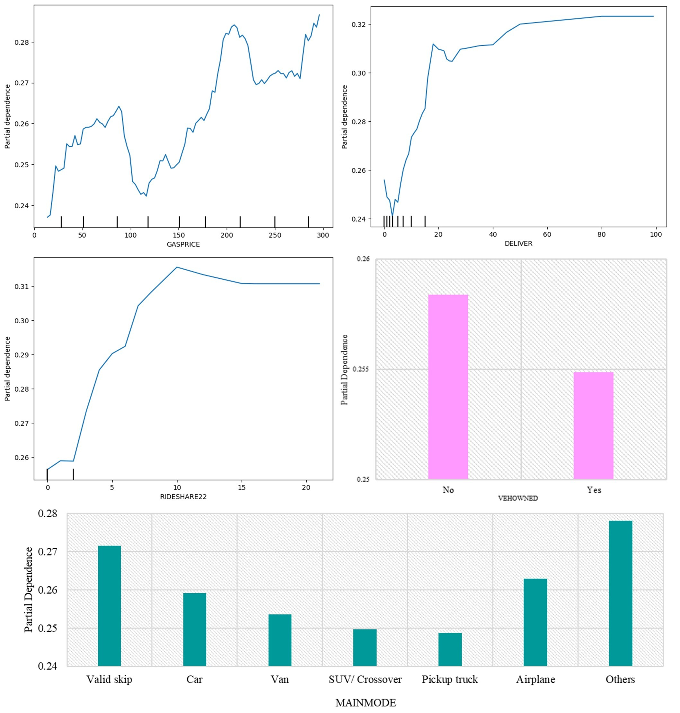

## <i>**📘 Title:** COVID-induced trip reduction behavior in United States</i>  

This study investigates how the COVID-19 pandemic affected trip-making behavior in the United States. Using the 2022 National Household Travel Survey (NHTS), the research analyzes how factors like time, location, income, age, education, and transportation modes influenced trip reduction during the pandemic. Machine learning methods, particularly random forests, were employed to identify key determinants and their interactions.

 

## 📈 Results

RF model outcome: accuracy (0.9705), precision (0.9588), recall (0.9235) and F-1 score (0.9408)

<b>ROC curve, AUC value (left) and confusion matrix (right) showing the performance of the random forest model</b>

    
  

<b>Importance of independent variables for describing trip reduction in the random forest model</b>

  

    
  

<b>Partial dependence plot for Monthly trip reduction due to COVID-19</b>

  

    
  

<b>Partial dependence plot for Monthly trip reduction due to COVID-19</b>  

      

    
  

 

<b>Partial dependence plot for weekly trip reduction</b>

    
  

<b>Partial dependence plot for spatial variation</b>

    
  

<b>Regional variation in Trip Reduction caused by COVID-19</b>

    
  

<b>Partial dependence plot for socio-economic variation</b>

    
  

<b>Partial dependence plot for transportation variation</b>

    
  

